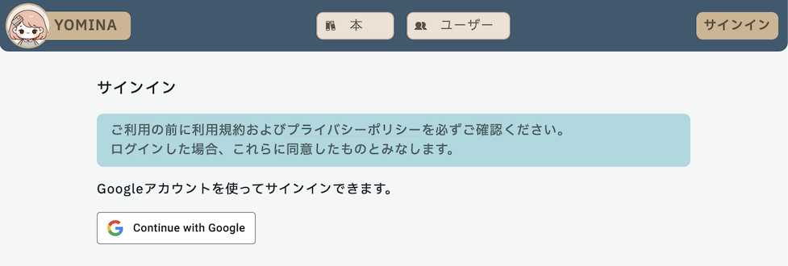
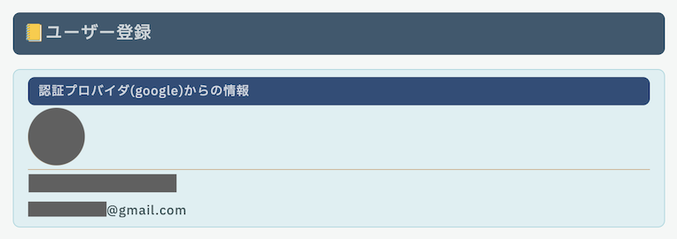
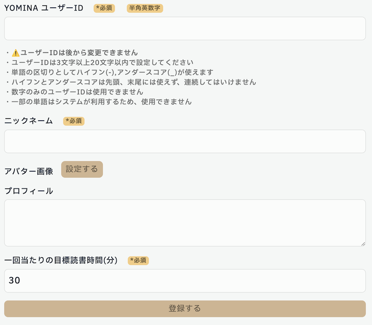

# サインイン

[**YOMINA**](https://yomina.app/)の利用には、Google アカウントが必要です。

## Google アカウントでのサインイン

1. 右上の「サインイン」をクリックします。
1. 利用規約およびプライバシーポリシーを確認後「Continue with Google」をクリックし、Google アカウントでログインします。
1. ログイン成功後、初めて YOMINA を利用する場合は、ユーザー情報を初期設定する画面に移動します。
1. ログイン成功後、すでに YOMINA を利用している場合は、ダッシュボード画面に移動します。

## 初期設定

YOMINA を初めて利用するとき、サインイン後に初期設定画面が表示されます。

認証プロバイダからの情報として、あなたが YOMINA のログインに使用している Google アカウントの情報が表示されます。

- メールアドレスが YOMINA 上で公開されることはありません。

---

1. **YOMINA ユーザー ID** を決めます。

- ほかのユーザーと同じユーザー ID は使えません
- 一部の英単語は YOMINA が今後利用する可能性があるため使用できない場合があります。
- ユーザー ID は、あなたが入力したコンテンツを表示する際に、URL に使用されます。
  - そのため、一度決めたユーザー ID を変更することはできません。

2. **ニックネーム**を決めます。
3. **アバター画像**を設定します。

- 設定しない場合、Google アカウントのアバター画像が表示されます。

4. **プロフィール**を入力します。

5. **一回あたりの目標読書時間(分)**を決めます。

- 「本を読む」機能を使う際の、目標時間の初期設定を決めます。

6. 「設定」をクリックすると、初期設定が完了です。
